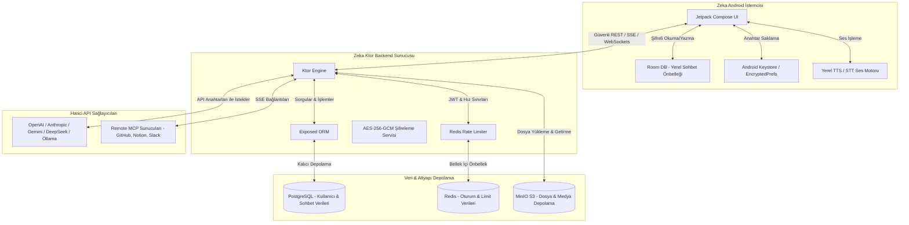

# 🧠 ZEKA — Çoklu Model Destekli & Gizlilik Odaklı Yapay Zeka Sohbet Ekosistemi

Zeka; kullanıcıların kendi API anahtarlarını (BYOK - Bring Your Own Key) kullanarak OpenAI, Anthropic, Gemini, DeepSeek, OpenRouter veya yerel Ollama modellerini bağlayabildikleri, uçtan uca modern ve minimalist bir yapay zeka istemci + backend ekosistemidir. 

Proje, AMOLED dostu premium bir monokrom tasarımla yazılmış **Jetpack Compose Android İstemcisi** ve Exposed ORM, Redis, PostgreSQL ile MinIO (S3) altyapısına sahip **Kotlin Ktor Backend Sunucusu** olmak üzere iki ana parçadan oluşmaktadır.

---

## 📐 Sistem Mimari Şeması

Aşağıdaki şemada istemci (`zeka-android`), backend (`zeka-backend`), yerel/bulut veritabanları, depolama birimleri ve harici API sağlayıcıları arasındaki veri akışı gösterilmektedir:



---

## 🛠 Kullanılan Teknolojiler ve Diller

### 1. Zeka Android İstemcisi (`zeka-android`)
- **Dil:** Kotlin (100% Native)
- **UI Framework:** Jetpack Compose (Modern Bildirimsel UI Tasarımı)
- **Dependency Injection:** Dagger Hilt
- **Veritabanı (Yerel Önbellek):** Room DB
- **Ağ İletişimi:** Retrofit & OkHttp (REST API ve Server-Sent Events/SSE)
- **Animasyon:** Compose Animation (`AnimatedVisibility`, `slideInVertically`, `fadeIn` vb.)
- **Güvenli Depolama:** Android Keystore tabanlı `EncryptedSharedPreferences`
- **Ses:** Android TextToSpeech (TTS) & SpeechRecognizer (STT)

### 2. Zeka Backend Sunucusu (`zeka-backend`)
- **Dil:** Kotlin (Asenkron & Coroutines Uyumlu)
- **Framework:** Ktor (Hafif ve Hızlı Web Sunucusu)
- **ORM & Veritabanı:** JetBrains Exposed & PostgreSQL
- **Bağlantı Havuzu:** HikariCP
- **Önbellek & Oturum:** Redis & Ktor Sessions
- **Dosya Depolama:** MinIO (Amazon S3 Uyumlu Nesne Depolama)
- **Güvenlik:** Java Cryptography Architecture (JCA) ile **AES-256-GCM** şifrelemesi

---

## 📦 Proje Dosya Yapısı ve Görevleri

```text
Zeka/
├── README.md                  # Proje ana dokümantasyonu (Bu dosya)
├── LICENSE                    # MIT Lisans belgesi
├── .gitignore                 # Git versiyon kontrolü dışlama kuralları
├── Zeka_App.apk               # Son derlenen release Android APK paketi
├── deploy-k8s.ps1             # Tek tıkla Kubernetes dağıtım PowerShell betiği
│
├── zeka-android/              # Native Android Mobil Uygulaması
│   ├── app/
│   │   ├── src/main/java/com/zeka/
│   │   │   ├── data/
│   │   │   │   ├── local/
│   │   │   │   │   ├── db/          # Room DB Entity'leri ve DAO'ları
│   │   │   │   │   └── model/       # MCP, Yetenek ve Eklenti veri modelleri & Store'ları
│   │   │   │   └── remote/          # Retrofit API servisleri ve SSE client'ları
│   │   │   ├── presentation/
│   │   │   │   ├── ui/
│   │   │   │   │   ├── chat/        # ChatScreen.kt (Ana arayüz ve katalog panelleri)
│   │   │   │   │   └── theme/       # Renk paleti (PureBlack, Graphite) ve Yazı tipleri
│   │   │   │   └── viewmodel/       # Sohbet akışı, dosya yükleme ve model durum yönetimi
│   │   └── build.gradle.kts         # Android modülü Gradle yapılandırması
│   └── build.gradle.kts             # Proje genel Gradle yapılandırması
│
└── zeka-backend/              # Kotlin Ktor Backend Servisi
    ├── src/main/kotlin/com/zeka/
    │   ├── plugins/                 # Ktor Route'ları, Güvenlik, Hata yönetimi, Serialization
    │   ├── db/                      # PostgreSQL şema tanımları ve veri tabanı başlatıcıları
    │   ├── security/                # AES-256-GCM Şifreleme / Deşifreleme yardımcı sınıfları
    │   ├── service/                 # Sohbet iletim, dosya yükleme (MinIO S3) servisleri
    │   └── Application.kt           # Ktor sunucusunu başlatan ana giriş noktası
    ├── k8s/                         # Kubernetes Deployment Manifest Dosyaları
    │   ├── k8s-secrets.yaml         # DB şifreleri, Redis parolaları ve şifreleme anahtarları
    │   ├── k8s-db.yaml              # PostgreSQL StatefulSet ve Redis Servisi
    │   └── k8s-backend.yaml         # Ktor Backend Deployment ve LoadBalancer servisi
    ├── docker-compose.yml           # Yerel geliştirme için Docker altyapısı (DB, Redis, MinIO)
    └── build.gradle.kts             # Ktor backend Gradle yapılandırması
```

---

## 🌟 Öne Çıkan Sistem Özellikleri ve Katalog Arayüzleri

### 1. BYOK (Bring Your Own Key) & Güvenlik
- Kullanıcılar kendi API anahtarlarını sisteme girerek aracı komisyonlar olmadan doğrudan servis sağlayıcılara bağlanırlar.
- API anahtarları veritabanında asla düz metin olarak tutulmaz. **AES-256-GCM** kullanılarak benzersiz tuzlama (salt) ve initialization vector (IV) ile şifrelenir. 
- İstemci tarafında hassas anahtarlar Android Keystore donanımıyla korunan `EncryptedSharedPreferences` içinde saklanır.

### 2. Gelişmiş Katalog Paneli & Akışkan Animasyonlar
Sohbet arayüzündeki model barlarından veya girdi alanındaki "+" butonuna tıklandığında açılan katalog ekranları ve veri ekleme pencereleri premium animasyonlara sahiptir:
- **Katalog Ekranları (MCP, Yetenek, Eklenti):** Sohbet geçmişinin üzerine aşağıdan yukarıya doğru süzülerek (`slideInVertically` + `fadeIn`) gelen bir overlay panel şeklinde tasarlanmıştır. Bu sayede sohbet ekranı arka planda korunur, düzen bozulmaz. Kapatıldığında ise aşağı kayarak sönümlenir.
- **Veri Giriş Overlay'leri (Yeni MCP/Yetenek Ekleme):** Graphite renk temalı, üstünde sürükleme çizgisi (drag handle) ve tıklanabilir arka plan perdesi (`scrim`) bulunan modern bottom-sheet tasarımlarına sahiptir.

### 3. MCP (Model Context Protocol) Desteği
- Zeka, yapay zekanın harici sistemlerle güvenli ve çift yönlü iletişim kurabilmesi için Anthropic'in Model Context Protocol standardını destekler.
- Hazır şablonlar (GitHub, Notion, Drive, Slack, PostgreSQL, Airtable) monokrom ve şık kart tasarımlarıyla sunulur.
- SSE (Server-Sent Events) protokolü aracılığıyla uzak MCP sunucuları kolaylıkla eklenebilir, bağlanabilir veya kapatılabilir.

### 4. Yetenekler (Skills) & Eklentiler (Plugins)
- **Yetenekler (Skills):** Prompt tabanlı hazır tetikleyiciler sunar. Örn: `#kod` (Yazılım Desteği), `#cevir` (Akıllı Çeviri), `#ozet` (Hızlı Özet). Yetenek kartları monokrom minimalist simgelerle ve trigger rozetleriyle gösterilir.
- **Eklentiler (Plugins):** Uygulama içine dinamik araçlar ekler. Örn: Dall-E 3 Görsel Üretici (Fırça simgesi), Borsa & Kripto (İvme grafiği simgesi), Hesap Analizcisi (Tablo simgesi).

---

## 🚀 Hızlı Başlangıç (Yerel Geliştirme Kurulumu)

### 1. Gerekli Önkoşullar
- Bilgisayarınızda **Docker** ve **Docker Compose** kurulu olmalıdır.
- Android geliştirme için **Android Studio** (Koala veya üzeri) kurulu olmalıdır.
- Sisteminizde **Java 17** yüklü olmalıdır.

### 2. Altyapı Servislerini Başlatma (PostgreSQL, Redis, MinIO)
Terminalden `zeka-backend` dizinine giderek Docker konteynerlerini başlatın:
```bash
cd zeka-backend
docker-compose up -d
```
*Bu komut PostgreSQL veritabanını, Redis önbellek sunucusunu ve MinIO nesne depolama s3 sunucusunu arka planda ayağa kaldıracaktır.*

### 3. Ktor Backend Sunucusunu Başlatma
Gerekli tablolar sunucu ilk çalıştığında otomatik olarak oluşturulacaktır:
```bash
# zeka-backend dizininde
./gradlew run
```
*Sunucu varsayılan olarak `http://localhost:8080` portunda yayına başlayacaktır.*

### 4. Android İstemcisini Çalıştırma
1. **Android Studio**'yu açın ve `zeka-android` dizinini proje olarak içeri aktarın (Import).
2. Derleme için JDK 17 kullandığınızdan emin olun:
   - *Android Studio -> Settings -> Build, Execution, Deployment -> Build Tools -> Gradle -> Gradle JDK -> JDK 17*
3. Cihazınızı bağlayın veya Emülatör açıp projeyi çalıştırın (Run).
   - *Not: Emülatör kullanıyorsanız, yerel backend sunucusuna bağlanabilmesi için `10.0.2.2:8080` adresi otomatik olarak ayarlanmıştır.*

---

## 🔒 Kubernetes Ortamında Canlıya Alım (Deployment)

Kubernetes ortamında (Local Minikube veya Cloud Cluster) tüm altyapı bileşenleri ve şifreli sırları (secrets) tek bir adımda ayağa kaldırmak için:

### 1. Otomatik Dağıtım (PowerShell)
Proje kök dizininde PowerShell üzerinde aşağıdaki dağıtım scriptini çalıştırmanız yeterlidir:
```powershell
./deploy-k8s.ps1
```
*Bu betik gizli anahtarları oluşturacak, PostgreSQL StatefulSet'lerini kuracak, Redis servislerini bağlayacak ve Ktor backend'ini dağıtarak dış dünyaya LoadBalancer servisi üzerinden açacaktır.*

### 2. Manuel Adım Adım Dağıtım
```bash
# 1. Gizli Anahtarları (Secrets) cluster'a tanımlayın
kubectl apply -f zeka-backend/k8s/k8s-secrets.yaml

# 2. Veritabanı ve Redis StatefulSet/Servislerini kurun
kubectl apply -f zeka-backend/k8s/k8s-db.yaml

# 3. Ktor Backend Deployment ve LoadBalancer servisini kurun
kubectl apply -f zeka-backend/k8s/k8s-backend.yaml
```

---

## 📄 Lisans
Bu proje **MIT Lisansı** altında lisanslanmıştır. Detaylar için [LICENSE](file:///c:/Users/HP/Desktop/Zeka/LICENSE) dosyasını inceleyebilirsiniz.
